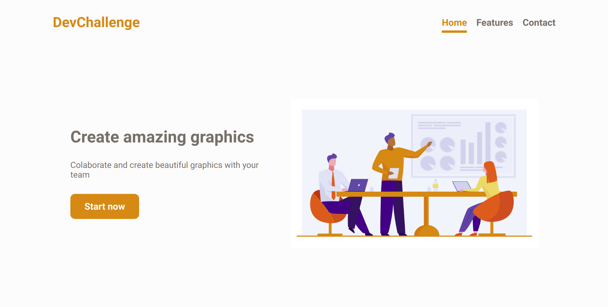
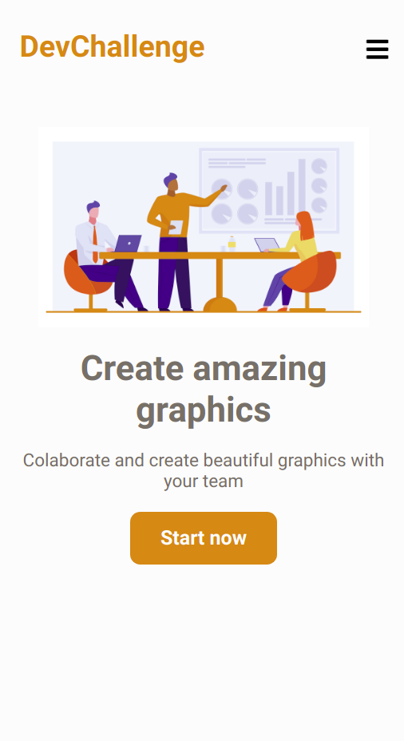

# Amazing Graph - DevChallenge

## Desafio:

Criar uma página sobre um site de criação de gráficos.

[Link do desafio](https://devchallenge.vercel.app/challenges/5ec9a7fc10e94a38493d3910/details) 

### Requisitos:

- **A página deve ser semelhante ao design.**
- **A página deve ser responsiva.** 

### Tecnologias utilizadas:

- HTML
- CSS
- Flexbox CSS
- Javascript
- FontAwesome
